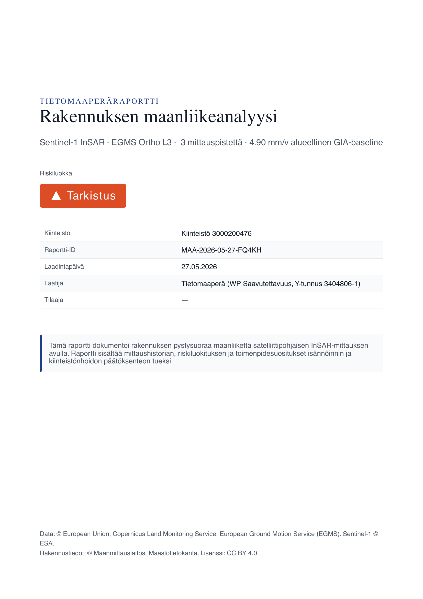
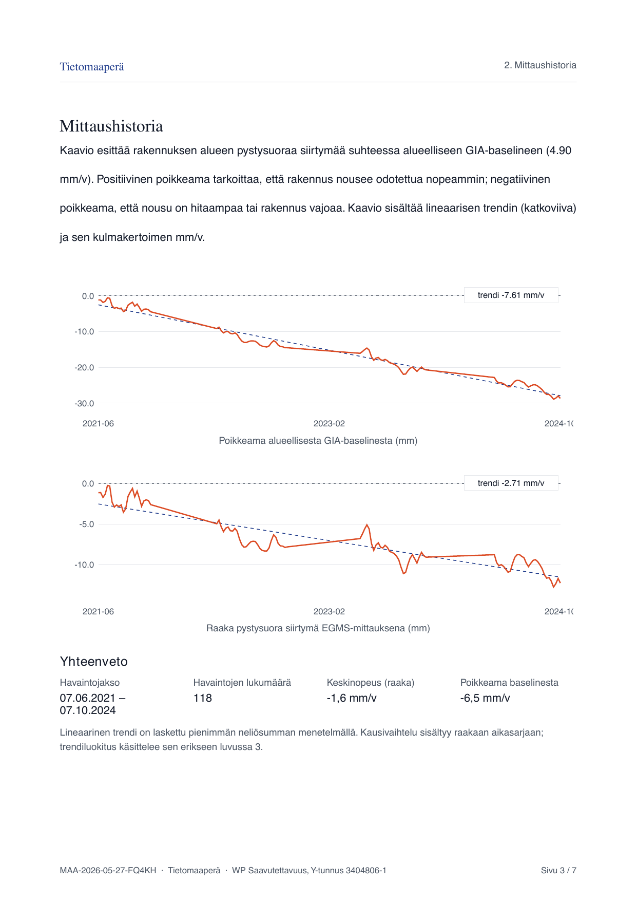
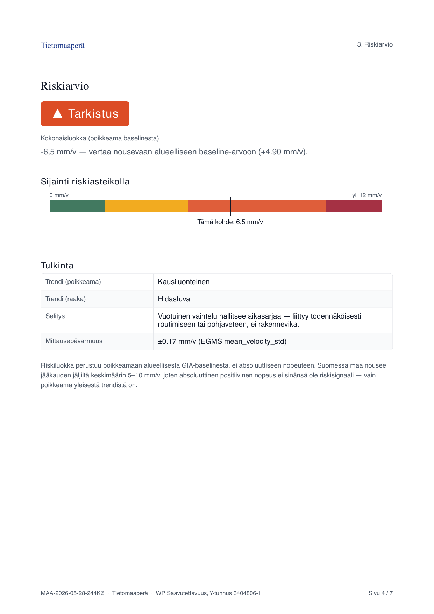
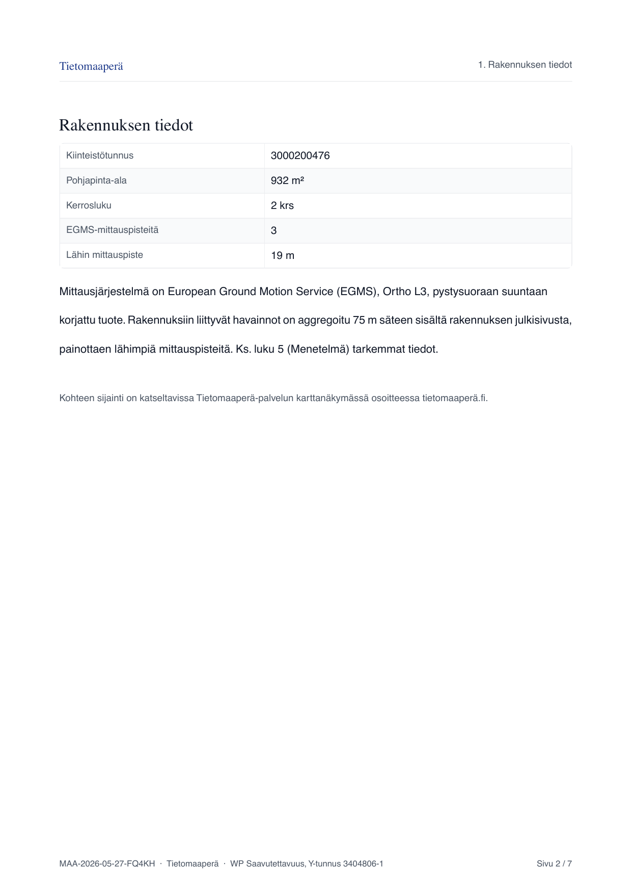

# Tietomaaperä

> Repo path stays `mikko-lab/maapera` (renaming is too expensive in broken-link terms). The product brand is **Tietomaaperä** (domain: `tietomaaperä.fi`).

InSAR-based ground motion monitoring for Finnish property managers. Surfaces European Ground Motion Service (EGMS) Sentinel-1 satellite data — millimetre-precision ground displacement from 2018 onwards — at the individual building level, translated into PTS-ready reports and continuous monitoring.

**Owner:** WP Saavutettavuus (Y-tunnus 3404806-1).
**Status:** MVP. Turku coverage live; demo PDF report shippable; Stripe + multi-city deferred to month 2.

See [CLAUDE.md](CLAUDE.md) for the full product/tech overview and current decisions.

## What works today

- **ETL** (`etl/`) — two EGMS Ortho-L3 tiles + MML Maastotietokanta → 22 651 Turku buildings classified by velocity anomaly against the regional GIA baseline, with 5.4 M timeseries rows preserved.
- **Frontend** (`web/`) — MapLibre + deck.gl building map; bbox-loaded FlatGeobuf, hyparquet timeseries on click, keyboard-accessible building panel.
- **PDF report** — 7-page Finnish report (`Tietomaaperäraportti`), generated client-side, WCAG-aware (shape + colour + text for risk class).
- **Supabase** — schema deployed with RLS on every public table; `bootstrap` + `timeseries` edge functions enforce tier-based feature flags and history trimming server-side. Stripe-driven tier transitions are the deferred piece.

## Sample report

Demo case `3000200476` (Kupittaa/Vasaramäki, attention-class):

| Kansi | Mittaushistoria | Riskiarvio | Rakennuksen tiedot |
|---|---|---|---|
|  |  |  |  |

Full demo script in [content/demo-script.md](content/demo-script.md).

## Repo layout

```
etl/        Python ETL: EGMS + MML → buildings_<city>.fgb + timeseries_<city>.parquet
supabase/   SQL migrations + Edge Functions (auth, paywall, PDF, alerts)
web/        Vite + React + MapLibre + deck.gl frontend
content/    Finnish-language copy, brand, screenshots
```

## Local dev

```bash
# ETL (uv)
cd etl && uv sync && uv run python -m src.run_pipeline

# Frontend (pnpm)
cd web && pnpm install && pnpm dev

# Supabase migrations
supabase db push --linked
```

The ETL writes `web/public/data/buildings_turku.fgb` (~10 MB) and `timeseries_turku.parquet` (~16 MB); both are gitignored and recreated by the pipeline (or fetched from R2 / Supabase Storage once the live deployment is up at `tietomaaperä.fi`).

## Related projects in this portfolio

- **[qubit-harness](https://github.com/mikko-lab/qubit-harness)** — LangGraph-based agentic harness. Different domain, same engineering principle: a deterministic safety layer (Pydantic-validated bounds) wrapping non-deterministic decision-making (LLM proposals there, noisy InSAR interpretations here).
- **[a11y-lead-engine](https://github.com/mikko-lab/a11y-lead-engine)** — automated accessibility auditing. Shares the Pydantic-validated pipeline pattern and the "explicit failure modes over silent defaults" rule.

Each repo can be read standalone; clicking through any one of them should reveal the others as part of a coherent body of work.
